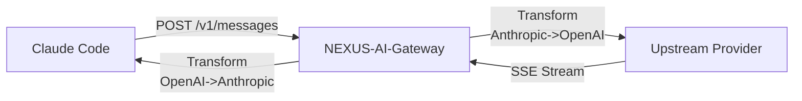
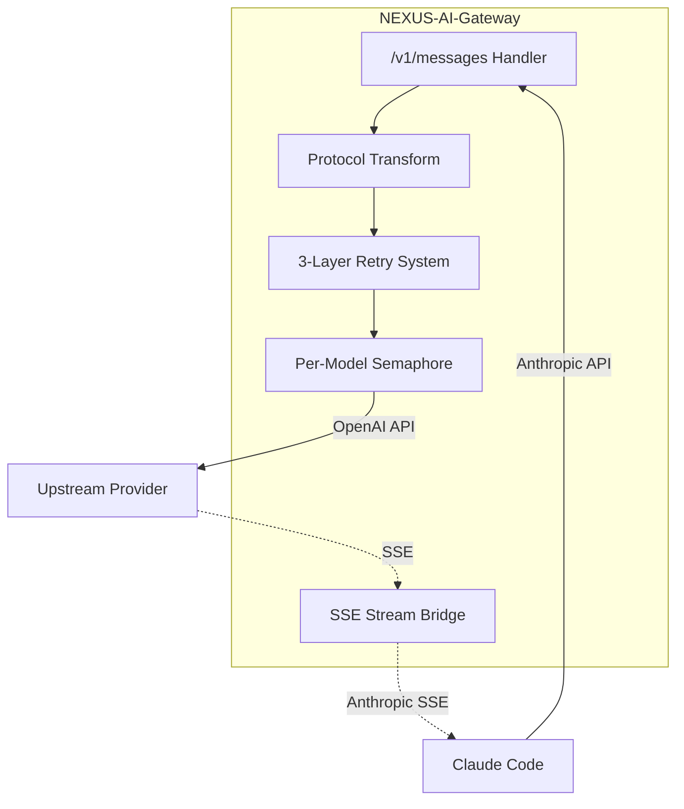

# NEXUS-AI-Gateway


API proxy translating Anthropic Messages API to OpenAI-compatible format.


[](https://github.com/enerBydev/NEXUS-AI-Gateway/actions)
[](https://opensource.org/licenses/MIT)
[](https://www.rust-lang.org)

## Quick Start — For Humans

### Prerequisites

- Rust 1.85+ (`rustup update`)
- Claude Code binary installed (`claude --version`)
- Upstream API key (NVIDIA NIM, OpenRouter, etc.)

### Install and Build

```bash
git clone https://github.com/enerBydev/NEXUS-AI-Gateway.git
cd NEXUS-AI-Gateway
cargo build --release
```

### Configure

```bash
# Interactive setup wizard (fastest path to working)
./target/release/nexus-ai-gateway setup --quick
```

> **Note**: The wizard validates your API key, scans the Claude Code binary for model IDs, and writes `~/.nexus-ai-gateway.env` with sensible defaults.

### Start the Proxy

```bash
# Foreground mode
./target/release/nexus-ai-gateway

# Or daemon mode
./target/release/nexus-ai-gateway --daemon
```

### Point Claude Code at the Proxy

```bash
export ANTHROPIC_BASE_URL="http://localhost:8315"
export ANTHROPIC_API_KEY="proxy"  # Any non-empty value works
claude
```

### Verify It Works

```bash
# Health check
curl http://localhost:8315/health

# Or use the built-in test command
nexus-ai-gateway config test
```

---

## AI Assistant Context

> This section is designed for AI assistants to quickly understand and configure NEXUS-AI-Gateway.

### Project Card

| Key | Value |
|-----|-------|
| Category | API Gateway / Protocol Translator |
| Language | Rust (2021 edition) |
| Framework | Axum 0.7 + Tokio 1.x |
| Binary Name | `nexus-ai-gateway` |
| Config File | `~/.nexus-ai-gateway.env` |
| Default Port | 8315 |
| Health Check | `GET /health` returns `OK` |
| Metrics | `GET /metrics` returns Prometheus format |

### Request Flow



### Critical Environment Variables

| Variable | Purpose | Example |
|----------|---------|---------|
| `UPSTREAM_BASE_URL` | OpenAI-compatible endpoint | `https://integrate.api.nvidia.com` |
| `UPSTREAM_API_KEY` | Authentication key | `nvapi-...` |
| `MODEL_MAP_<claude_id>` | Route models to upstreams | `MODEL_MAP_claude_sonnet_4_6=default:meta/llama-3-70b` |

### Model Routing Syntax

Hyphens in Claude model IDs become underscores in env var names:

```bash
MODEL_MAP_claude_opus_4_6=default:z-ai/glm5
MODEL_MAP_claude_sonnet_4_6=bigmodel:glm-4-plus
MODEL_MAP_claude_haiku_4_5=default:moonshotai/kimi-k2.5
```

Format: `MODEL_MAP_<claude_id_with_underscores>=<upstream_name>:<target_model>`

### Troubleshooting Quick Reference

| Symptom | Cause | Fix |
|---------|-------|-----|
| `Connection refused` | Proxy not running | Start with `nexus-ai-gateway` |
| `invalid_api_key` | Upstream key wrong | Check `UPSTREAM_API_KEY` |
| `model_not_found` | Model map invalid | Verify `MODEL_MAP_*` vars |
| `timeout` | Upstream slow | Increase `PERMIT_TIMEOUT_SECS` |
| `rate_limit` | Too many requests | Reduce `MAX_CONCURRENT_PER_MODEL` |

### LLMS.TXT

```
name: NEXUS-AI-Gateway
category: api-gateway
port: 8315
config: ~/.nexus-ai-gateway.env
setup: nexus-ai-gateway setup --quick
test: nexus-ai-gateway config test
logs: RUST_LOG=debug
```

---

## Architecture



**Key Design Decisions**:

- **Bidirectional translation**: Anthropic Messages API to OpenAI Chat Completions and back
- **3-layer retry**: Status code classification → Content-aware pattern matching → Structural error analysis
- **Auto-fix**: `max_tokens` overflow triggers halving (minimum 4096) with automatic retry
- **WebFetch interception**: Local execution of `web_fetch` tool calls with HTML-to-text conversion
- **Model identity preservation**: Responses return original Claude model IDs even when routed to different upstream models

---

## Configuration

### Environment Variables

#### Required

| Variable | Default | Description |
|----------|---------|-------------|
| `UPSTREAM_BASE_URL` | — | OpenAI-compatible API endpoint |
| `UPSTREAM_API_KEY` | — | Authentication key for upstream (or `OPENROUTER_API_KEY`). Also loadable from a file via `UPSTREAM_API_KEY_FILE` |

> **Secret from file (Issue #115):** any API-key variable accepts a `*_FILE` sibling
> (`UPSTREAM_API_KEY_FILE`, `OPENROUTER_API_KEY_FILE`, `UPSTREAM_BIGMODEL_API_KEY_FILE`,
> `UPSTREAM_CF_API_KEY_FILE`) pointing at a file whose trimmed contents are the secret —
> ideal for Docker/Kubernetes secrets and systemd `LoadCredential=`. The direct value
> wins when both are set; an empty/unreadable file is warned and ignored. See
> [SECURITY.md](SECURITY.md#secret-management--_file-convention-issue-115).

#### Server

| Variable | Default | Description |
|----------|---------|-------------|
| `PORT` | `8315` | HTTP server port |
| `BIND_ADDR` | `127.0.0.1` | Listener bind address (loopback-only by default). Set `0.0.0.0` to expose on all interfaces (opt-in). Also `--bind`. Legacy `HOST` is deprecated/ignored |
| `ALLOWED_IPS` | — | Optional comma-separated CIDR/IP allowlist (defense-in-depth). Empty = allow all; loopback always allowed |
| `CORS_ALLOWED_ORIGINS` | `http://localhost:8315` | Comma-separated allowed origins |

#### Model Routing

| Variable | Format | Description |
|----------|--------|-------------|
| `MODEL_MAP_<claude_id>` | `<upstream>:<model>` | Route Claude models to upstreams |
| `REASONING_MODEL` | `<model_id>` | Model for reasoning tasks |
| `COMPLETION_MODEL` | `<model_id>` | Model for completion tasks |

#### Proxy Behavior

| Variable | Default | Description |
|----------|---------|-------------|
| `MAX_CONCURRENT_PER_MODEL` | `5` | Concurrent requests per model |
| `PERMIT_TIMEOUT_SECS` | `180` | Max wait for semaphore permit |
| `WEB_FETCH_ENABLED` | `true` | Enable WebFetch interception |
| `WEB_FETCH_MAX_RETRIES` | `3` | Retries for WebFetch failures |
| `WEB_FETCH_TIMEOUT_SECS` | `15` | Timeout for WebFetch requests |

#### Circuit Breaker

| Variable | Default | Description |
|----------|---------|-------------|
| `CB_ENABLED` | `false` | Enable circuit breaker |
| `CB_THRESHOLD` | `10` | Failures before opening circuit |
| `CB_RECOVERY_SECS` | `60` | Seconds before recovery attempt |

#### Model Discovery

| Variable | Default | Description |
|----------|---------|-------------|
| `DISABLE_PROBING` | `false` | Disable model capability probing |
| `MODEL_LIMIT_OVERRIDES` | — | JSON map of model→max_tokens overrides |
| `PROBE_CACHE_TTL_SECS` | `3600` | Probe result cache TTL |
| `PROBE_TIMEOUT_SECS` | `15` | Timeout for probe requests |

#### Context Window Sync

| Variable | Default | Description |
|----------|---------|-------------|
| `CC_CONTEXT_WINDOW` | `200000` | Manual override for CC's context window (tokens) |
| `CC_MODEL_CONTEXT_WINDOWS` | — | Per-model mapping: `model-id:tokens,model-id:tokens` |
| `CLAUDE_CODE_AUTO_COMPACT_WINDOW` | — | Auto-detected from Claude Code runtime (priority over `CC_CONTEXT_WINDOW`) |

Resolution priority (highest → lowest):
1. `CC_MODEL_CONTEXT_WINDOWS` per-model entry for the requested model
2. `CLAUDE_CODE_AUTO_COMPACT_WINDOW` (set automatically by Claude Code)
3. `CC_CONTEXT_WINDOW` (manual global override)
4. `200_000` default

#### Prompt Cache (NIM KV_REUSE)

| Variable | Default | Description |
|----------|---------|-------------|
| `NIM_PROMPT_CACHE_ENABLED` | `false` | Enable prompt caching |
| `NIM_PROMPT_CACHE_MAX_ENTRIES` | `1000` | Max cache entries |
| `NIM_PROMPT_CACHE_TTL_SECS` | `300` | Cache entry TTL |

#### Advanced

| Variable | Default | Description |
|----------|---------|-------------|
| `DRAIN_TIMEOUT_SECS` | `30` | Graceful shutdown timeout |
| `RUST_LOG` | — | Log level (debug, info, warn, error) |
| `NEXUS_UPSTREAM_TYPE` | `nim` | Protocol variant (nim, anthropic, openai, openrouter) |
| `DEBUG` | `false` | Enable debug mode |
| `VERBOSE` | `false` | Enable verbose (trace) logging |
| `CC_OVERFLOW_THRESHOLD_PCT` | `80` | Context overflow threshold (range: 50-95) |

#### Additional Upstreams

| Variable | Description |
|----------|-------------|
| `UPSTREAM_BIGMODEL_BASE_URL` | BigModel endpoint |
| `UPSTREAM_BIGMODEL_API_KEY` | BigModel API key |
| `UPSTREAM_CF_BASE_URL` | Cloudflare endpoint |
| `UPSTREAM_CF_API_KEY` | Cloudflare API key |

### Config File Search Order

1. `-c, --config <FILE>` (CLI flag)
2. `./.env` (current directory)
3. `~/.nexus-ai-gateway.env` (home directory)
4. `/etc/nexus-ai-gateway/.env` (system-wide)

---

## API Endpoints

| Endpoint | Method | Description |
|----------|--------|-------------|
| `/v1/messages` | POST | Main proxy endpoint (Anthropic Messages API) |
| `/v1/messages/count_tokens` | POST | Token count estimation |
| `/health` | GET | Health check |
| `/metrics` | GET | Prometheus metrics |

---

## CLI Commands

| Command | Description |
|---------|-------------|
| `nexus-ai-gateway` | Start the proxy server |
| `nexus-ai-gateway setup` | Interactive configuration wizard |
| `nexus-ai-gateway setup --quick` | Fast mode (API key only) |
| `nexus-ai-gateway scan` | Scan Claude Code binary for model IDs |
| `nexus-ai-gateway scan --env` | Generate `.env` template |
| `nexus-ai-gateway scan --launcher` | Generate launcher script |
| `nexus-ai-gateway config show` | Display current configuration |
| `nexus-ai-gateway config set KEY VALUE` | Modify a setting |
| `nexus-ai-gateway config test` | Test connectivity and mappings |
| `nexus-ai-gateway status` | Check daemon status |
| `nexus-ai-gateway stop` | Stop running daemon |

### Global Options

| Flag | Description |
|------|-------------|
| `-c, --config <FILE>` | Use custom config file |
| `-p, --port <PORT>` | Override port |
| `-d, --debug` | Enable debug logging |
| `-v, --verbose` | Enable verbose logging |
| `--daemon` | Run as background daemon |

---

## Development

```bash
# Build
cargo build --release

# Test
cargo test

# Lint
cargo clippy -- -D warnings

# Format check
cargo fmt --check

# Security audit
cargo audit
```

---

## Deployment

### systemd Service

```bash
# Install user service
./scripts/install-service.sh

# Manage
systemctl --user start nexus-ai-gateway
systemctl --user status nexus-ai-gateway
journalctl --user -u nexus-ai-gateway -f
```

### Deploy Script

```bash
# Full deploy with build + service install
./scripts/deploy.sh
```

<details>
<summary>Advanced: Manual systemd config</summary>

Create `~/.config/systemd/user/nexus-ai-gateway.service`:

```ini
[Unit]
Description=NEXUS-AI-Gateway
After=network.target

[Service]
Type=simple
ExecStart=%h/.cargo/bin/nexus-ai-gateway
Restart=on-failure
RestartSec=5

[Install]
WantedBy=default.target
```

Enable: `systemctl --user daemon-reload && systemctl --user enable --now nexus-ai-gateway`
</details>

---

## License

[MIT](LICENSE) © enerBydev
